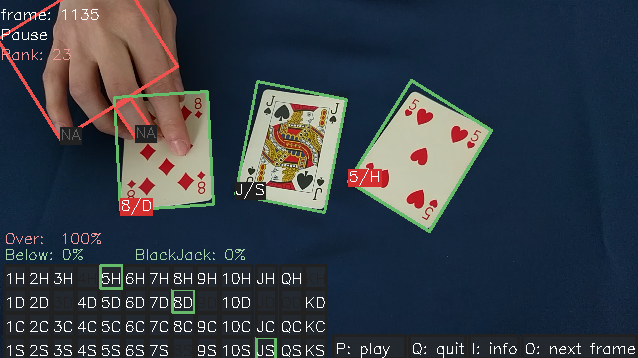
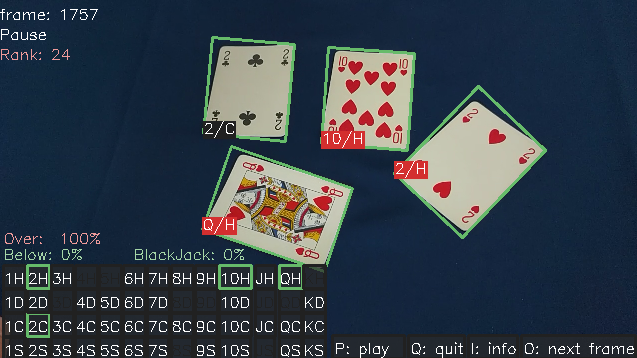
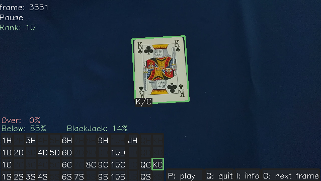
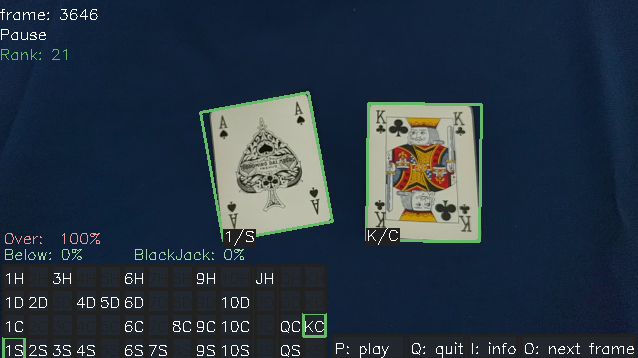

# Computer Vision Project: BlackJack cards detector

Project for master course Computer Vision (2018-2019) at Ca' Foscari University.  
**Running at 27-30 ms per frame** (= 35 fps) +7 ms for debugging/visualization.

Automatic card detector during a black jack game, works with moving camera.
Single deck used, displays info for the entire deck, keeps track of played cards 
and displays the win probability when a new card is drawn.

Screenshots  

  
   

  
   

